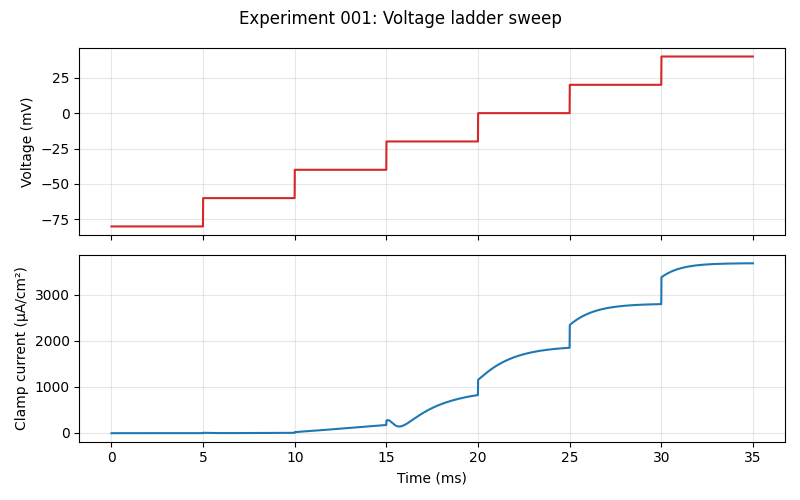
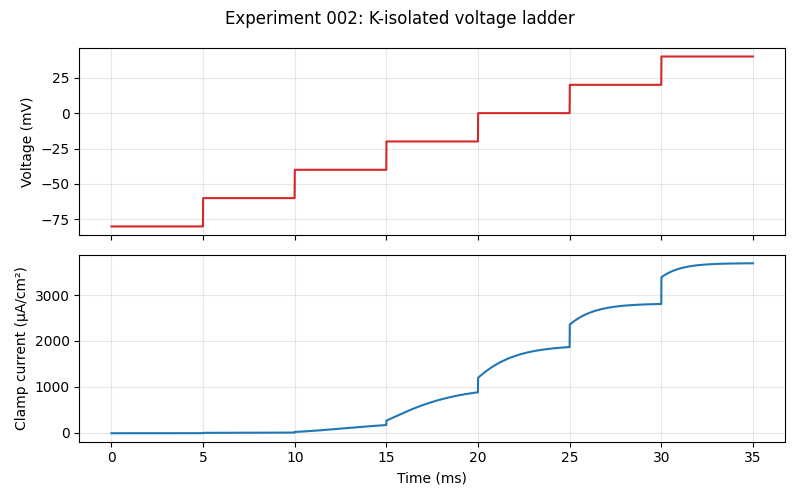
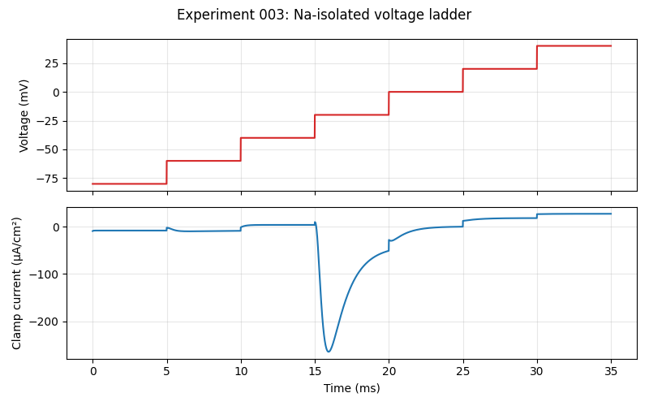
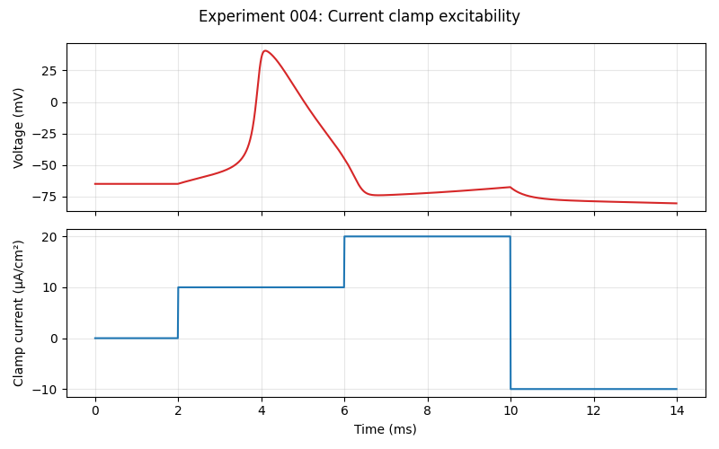

# HH Agent Lab — Run 20260330_111608

## Experiment 001: Voltage ladder sweep

**Rationale:** Steady-state IV sampling

**Mode:** voltage
**Blocks:** Na=0.00, K=0.00

**Insights:**
- **Conductance slope (approx g_total):** 32.80 µS/cm²
- **Reversal estimate:** -60.30 mV
- **Data points:** (-80, -7.9), (-60, -2.1), (-40, 155.6), (-20, 786.6), (0, 1836.3), (20, 2796.3), (40, 3688.7)

---
## Experiment 002: K-isolated voltage ladder

**Rationale:** Steady-state IV sampling

**Mode:** voltage
**Blocks:** Na=1.00, K=0.00

**Insights:**
- **Conductance slope (approx g_total):** 32.82 µS/cm²
- **Reversal estimate:** -60.69 mV
- **Data points:** (-80, -7.9), (-60, 4.6), (-40, 155.6), (-20, 853.4), (0, 1852.3), (20, 2799.9), (40, 3689.1)

---
## Experiment 003: Na-isolated voltage ladder

**Rationale:** Steady-state IV sampling

**Mode:** voltage
**Blocks:** Na=0.00, K=1.00

**Insights:**
- **Conductance slope (approx g_total):** 0.28 µS/cm²
- **Reversal estimate:** -9.10 mV
- **Data points:** (-80, -7.7), (-60, -8.4), (-40, 4.3), (-20, -56.4), (0, 0.3), (20, 18.7), (40, 27.9)

---
## Experiment 004: Current clamp excitability

**Rationale:** Probe spikes and membrane recovery

**Mode:** current
**Blocks:** Na=0.00, K=0.00

**Insights:**
- **Peak voltage:** 40.7 mV
- **Minimum voltage:** -80.5 mV
- **Spike indicator:** yes

---

## Run Summary

- IV slope 32.80 µS/cm², reversal ~-60.3 mV
- IV slope 32.82 µS/cm², reversal ~-60.7 mV
- IV slope 0.28 µS/cm², reversal ~-9.1 mV
- Current clamp peak 40.7 mV, spike=yes
